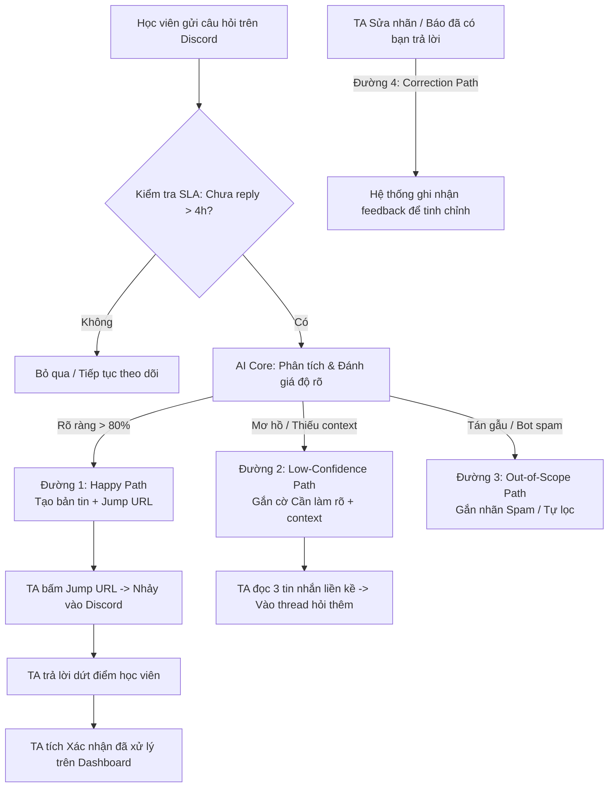

# CHECKPOINT 2 (CP2) — SƠ ĐỒ LUỒNG HOẠT ĐỘNG (FLOWCHART)
**Dự án:** Bản Tin Câu Hỏi Tồn & Điều Hướng Trực Tiếp Cho TA  
**Nhóm:** K4-3A-E403-DamNhauNgayMuaRoi · **Track:** B2 (Trợ lý Discord) · **Hạn nộp:** 21:00 16/9

---

## 1. Yêu Cầu Của Checkpoint 2 (Gathered Requirements)

Căn cứ theo [01-challenge-brief.md](file:///c:/Users/hungn/OneDrive/Desktop/vin/K4-3A-E403-DamNhauNgayMuaRoi/huong_dan/01-challenge-brief.md), [02-guide.md](file:///c:/Users/hungn/OneDrive/Desktop/vin/K4-3A-E403-DamNhauNgayMuaRoi/huong_dan/02-guide.md), [04-rubric.md](file:///c:/Users/hungn/OneDrive/Desktop/vin/K4-3A-E403-DamNhauNgayMuaRoi/huong_dan/04-rubric.md) và [README.md](file:///c:/Users/hungn/OneDrive/Desktop/vin/K4-3A-E403-DamNhauNgayMuaRoi/README.md):

### Mục tiêu của CP2:
- **Nhìn được cả luồng từ đầu đến cuối:** Người dùng (TA) bấm gì trước, thấy gì sau, kết thúc ở đâu.
- **Tiêu chí xác minh của TA (2 phút kiểm tra):**
  - [x] Flow chính bấm/đi hết được từ đầu đến cuối (không can thiệp thủ công).
  - [x] Repo có commit đầu cho CP2.
- **Hình thức thực hiện được chọn:** Sơ đồ luồng hoạt động (Flowchart) định dạng XML dùng trên **draw.io** (`cp2_flowchart.drawio.xml` & `cp2_flowchart.xml`).
- **Phạm vi kỹ thuật tại CP2:** Chưa cần AI chạy thật (AI chạy thật là ở CP3). Sơ đồ phải vạch rõ ranh giới: đâu là người dùng bấm, đâu là hệ thống xử lý, đâu là lời gọi AI, và hệ thống ứng xử thế nào qua 4 đường đi trải nghiệm.

---

## 2. Thiết Kế Sơ Đồ Luồng (4 Phân Vùng - Swimlanes)

Sơ đồ được thiết kế với 4 làn bơi (Swimlanes) trực quan:

| Làn bơi (Swimlane) | Vai trò & Trách nhiệm |
|---|---|
| **1. Kênh Discord & Học viên** | Nơi học viên đặt câu hỏi (`channel_01` .. `12`), tin nhắn trôi giữa hàng trăm tin chat, điểm nhảy đến của Jump URL và nơi học viên nhận được phản hồi chính thức. |
| **2. Bộ máy AI & Xử lý Dữ liệu** | Cron job quét log định kỳ (15–30p), bộ lọc tính SLA (>4h chưa reply), LLM phân loại chủ đề (Workshop/Lab/Phoenix/Logistics), tổng hợp tóm tắt ngắn & đính kèm Jump URL (`https://discord.com/channels/...`). |
| **3. Bản tin tổng hợp (Dashboard TA)** | Giao diện hiển thị thống kê tổng quan (số câu tồn, phân bổ theo cụm), danh sách thẻ câu hỏi theo từng trạng thái (Rõ ràng, Cảnh báo mơ hồ, Spam) và cập nhật thời gian thực khi câu hỏi được giải quyết. |
| **4. Trợ giảng (TA / Moderator)** | Đăng nhập ca trực, rà soát thẻ câu hỏi theo mức độ ưu tiên, bấm **[🔗 Nhảy tới Discord]**, soạn phản hồi chính thức cho học viên, và quay lại Dashboard bấm **[Xác nhận đã xử lý]** để hoàn tất ca trực. |

---

## 3. Thể Hiện Đầy Đủ 4 Đường Đi Trải Nghiệm (4 UX Paths)

Bám sát quy chuẩn HAX / PAIR từ [spec.md](file:///c:/Users/hungn/OneDrive/Desktop/vin/K4-3A-E403-DamNhauNgayMuaRoi/spec.md):

### Chi tiết 4 đường đi:
1. **Đường 1 (Xanh lá - Happy Path):**
   - *Tình huống:* Câu hỏi rõ ràng, tồn đọng >4h (vd: `M69081` *"có điểm danh ws không ạ"*).
   - *Hành vi:* AI trích xuất tóm tắt, gom nhóm Workshop, tạo Jump URL. TA bấm link nhảy trực tiếp đến Discord, reply học viên và quay lại tích "Đã giải quyết".
2. **Đường 2 (Vàng - Low-confidence Path):**
   - *Tình huống:* Câu hỏi cụt lủn, thiếu ngữ cảnh (vd: `M33885` *"vào mà cứ bị out ra thì phải làm sao ạ"*).
   - *Hành vi:* Áp dụng **HAX G10 (Thu hẹp phạm vi khi nghi ngờ)** — AI không đoán bừa, gắn nhãn `[⚠️ Cần làm rõ ngữ cảnh]` kèm 3 tin nhắn thảo luận xung quanh. TA bấm link vào Discord tag học viên hỏi rõ lỗi ở đâu.
3. **Đường 3 (Đỏ - Out-of-scope / Failure Path):**
   - *Tình huống:* Tin tán gẫu, meme, thông báo bot (`health check`, `bot reminder`).
   - *Hành vi:* Áp dụng **HAX G8 (Gạt bỏ dễ dàng)** — AI tự động loại khỏi danh sách tồn; nếu lọt vào, TA có nút `[Bỏ qua - Không phải câu hỏi]` một chạm.
4. **Đường 4 (Tím - Correction & Feedback Path):**
   - *Tình huống:* AI phân loại nhầm chủ đề hoặc câu hỏi đã được bạn học khác giải đáp trong thread chat.
   - *Hành vi:* Áp dụng **HAX G9 (Sửa dễ dàng)** & **HAX G15 (Mời feedback)** — TA bấm `[Sửa chủ đề]` hoặc `[Đã có người giải đáp]`. Hệ thống cập nhật trạng thái ngay và lưu log tinh chỉnh bộ lọc.

---

## 4. File Sơ Đồ XML & Hướng Dẫn Mở Trên Draw.io

### Các file đã tạo trong repo:
- [cp2_flowchart.drawio.xml](file:///c:/Users/hungn/OneDrive/Desktop/vin/K4-3A-E403-DamNhauNgayMuaRoi/cp2_flowchart.drawio.xml) *(File Draw.io chuẩn XML)*
- [cp2_flowchart.xml](file:///c:/Users/hungn/OneDrive/Desktop/vin/K4-3A-E403-DamNhauNgayMuaRoi/cp2_flowchart.xml) *(Bản sao định dạng .xml tương thích mọi trình import)*
- [generate_drawio.py](file:///c:/Users/hungn/OneDrive/Desktop/vin/K4-3A-E403-DamNhauNgayMuaRoi/generate_drawio.py) *(Script tạo & tùy biến sơ đồ tự động)*

### Cách mở trên Draw.io:
1. Truy cập [app.diagrams.net](https://app.diagrams.net) (hoặc mở Extension *Draw.io Integration* trong VS Code).
2. Chọn **File** → **Open From** → **Device...** (hoặc kéo thả trực tiếp file `cp2_flowchart.drawio.xml` vào cửa sổ trình duyệt).
3. Toàn bộ 4 làn bơi, các khối tương tác, màu sắc phân biệt 4 đường đi và liên kết mũi tên trực quan sẽ hiện ra hoàn chỉnh.
